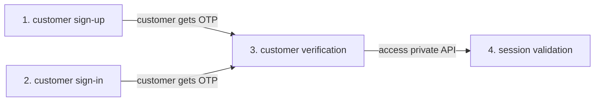
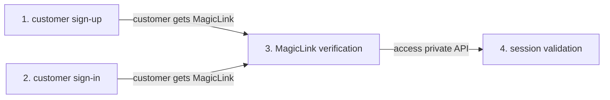

[](https://github.com/descope/go-sdk/actions/workflows/ci.yml)

# ExpressSDK for Go
Use the Descope ExpresSDK for Go to quickly and easily add user authentication to your application or website. If you need more background on how the ExpresSDKs work, [click here](/sdk/index.mdx). 

The SDK will require a valid `DESCOPE_PROJECT_ID`, which confirms that you are a registered Descope customer. We'll show you below exactly where to find your Project ID and how to set it.

## ExpressStart with OTP Authentication

This section will show you how to implement user authentication using a one-time password (OTP). A typical four step flow for OTP authentictaion is shown below.



### Prerequisites

Replace any instance of  `<ProjectID>` in the code below with your company's Project ID, which can be found in the [Descope console](https://app.descope.com).

* Run the following commands in your project

     These commands will add the Descope Go ExpresSDK as a project dependency and set the `DESCOPE_PROJECT_ID`.

     ```bash
    go get -u github.com/descope/go-sdk
    export DESCOPE_PROJECT_ID=<ProjectID>
     ```

* Import and initialize the ExpresSDK for Go client in your source code

    ```golang
    import (
        github.com/descope/go-sdk/descope
    )

    descopeClient, err := descope.NewDescopeClient()
    ```

### 1. Customer Sign-up

In your sign-up route for OTP (for example, `myapp.com/signup`) generate a sign-up request and send the OTP verification code via the selected delivery method. In the example below an email is sent to "mytestmail@test.com". In additon, optional user data (for exmaple, a custom username in the code sample below) can be gathered during the sign-up process.

```golang
if err := descopeClient.Auth.OTP().SignUp(auth.MethodEmail, "mytestmail@test.com", &auth.User{Username: "newusername"}); err != nil {
    // handle error
}
```

### 2. Customer Sign-in
In your sign-in route for OTP (for exmaple, `myapp.com/login`) generate a sign-in request send the OTP verification code via the selected delivery method. In the example below an email is sent to "mytestmail@test.com".

```golang
identifier := "mytestmail@test.com"
if err := descopeClient.Auth.OTP().SignIn(auth.MethodEmail, identifier); err != nil {
    // handle error
}
```

### 3. Customer Verification

In your verify customer route for OTP (for example, `myapp.com/verify`) verify the OTP from either a customer sign-up or sign-in. The VerifyCode function call will write the necessary tokens and cookies to the response writer (`w`), which will be used by the Go client to validate each session interaction.

```golang
if _, err := descopeClient.Auth.OTP().VerifyCode(auth.MethodEmail, "mytestmail@test.com", code, w); err != nil {
    // handle error
}
```

### 4. Session Validation

Session validation checks to see that the visitor to your website or application is who they say they are, by comparing the value in the validation variables against the session data that is already stored.

In the code below the Request argument (r) parses and validates the tokens and cookies from the client. ValidateSession returns true if the user is authorized, and false if the user is not authorized. In addition, the session will automatically be extended if the user is valid but the sesssion has expired by writing the updated tokens and cookies to the response writer (w).

```golang
if authorized, userToken, err := descopeClient.Auth.ValidateSession(r, w); !authorized {
    // unauthorized error
}
```

##### Session Validation Using Middleware
Alternativly, you can validate the session using any supported builtin Go middleware (for example Chi or Mux) instead of using the ValidateSessions function.
This middleware will automatically detect the cookies from the request and save the current user id in the context for farther usage, on failure, it will return 401 Unauthorized.

```golang
r.Use(auth.AuthenticationMiddleware(descopeClient.Auth, nil, nil))
```

## ExpressStart with MagicLink Authentication

This section will help you implement user authentication using Magiclinks. A typical four step flow for OTP authentictaion is shown below.



### Prerequisites

Replace any instance of  `<ProjectID>` in the code below with your company's Project ID, which can be found in the [Descope console](https://app.descope.com).

* Run the following commands in your project

     These commands will add the Descope Go ExpresSDK as a project dependency and set the `DESCOPE_PROJECT_ID`.

     ```bash
    go get -u github.com/descope/go-sdk
    export DESCOPE_PROJECT_ID=<ProjectID>
     ```

* Import and initialize the ExpresSDK for Go client in your source code

    ```golang
    import (
        github.com/descope/go-sdk/descope
    )

    descopeClient, err := descope.NewDescopeClient()
    ```

### 1. Customer Sign-up

In your sign-up route using magic link (for example, `myapp.com/signup`) generate a sign-up request and send the magic link via the selected delivery method. In the example below an email is sent to "mytestmail@test.com" containing the magic link and the link will automatically return back to the provided URL ("https://mydomain.com/verify"). In additon, optional user data (for exmaple, a custom username in the code sample below) can be gathered during the sign-up process.

```golang
if err := descopeClient.Auth.MagicLink().SignUp(auth.MethodEmail, "mytestmail@test.com", "https://mydomain.com/verify", &auth.User{Username: "newusername"}); err != nil {
    // handle error
}
```

### 2. Customer Sign-in
In your sign-in route using magic link (for exmaple, `myapp.com/login`) generate a sign-in request send the magic link via the selected delivery method. In the example below an email is sent to "mytestmail@test.com" containing the magic link and the link will automatically return back to the provided URL ("https://mydomain.com/verify"). 

```golang
identifier := "mytestmail@test.com"
if err := descopeClient.Auth.MagicLink().SignIn(auth.MethodEmail, identifier, "https://mydomain.com/verify"); err != nil {
    // handle error
}
```

### 3. Customer Verification

In your verify customer route for magic link (for example, `mydomain.com/verify`) verify the token from either a customer sign-up or sign-in. The VerifyMagicLink function call will write the necessary tokens and cookies to the response writer (`w`), which will be used by the Go client to validate each session interaction.

```golang
if _, err := descopeClient.Auth.MagicLink().Verify(auth.MethodEmail, "mytestmail@test.com", token, w); err != nil {
    // handle error
}
```

### 4. Session Validation

Session validation checks to see that the visitor to your website or application is who they say they are, by comparing the value in the validation variables against the session data that is already stored.

In the code below the Request argument (r) parses and validates the tokens and cookies from the client. ValidateSession returns true if the user is authorized, and false if the user is not authorized. In addition, the session will automatically be extended if the user is valid but the sesssion has expired by writing the updated tokens and cookies to the response writer (w).

```golang
if authorized, userToken, err := descopeClient.Auth.ValidateSession(r, w); !authorized {
    // unauthorized error
}
```

##### Session Validation Using Middleware
Alternativly, you can validate the session using any supported builtin Go middleware (for example Chi or Mux) instead of using the ValidateSessions function.
This middleware will automatically detect the cookies from the request and save the current user id in the context for farther usage, on failure, it will return 401 Unauthorized.

```golang
r.Use(auth.AuthenticationMiddleware(descopeClient.Auth, nil, nil))
```

## Run the Go Examples

Instantly run the end-to-end ExpresSDK for Go examples, as shown below. The source code for these examples are in the folder [GitHib go-sdk/examples folder](https://github.com/descope/go-sdk/blob/main/examples).

### Prerequisites

Run the following commands in your project. Replace any instance of  `<ProjectID>` in the code below with your company's Project ID, which can be found in the [Descope console](https://app.descope.com).

This commands will add the Descope Go ExpresSDK as a project dependency, clone the Go repository locally, and set the `DESCOPE_PROJECT_ID`.

```code Go
go get -u github.com/descope/go-sdk
git clone github.com/descope/go-sdk
export DESCOPE_PROJECT_ID=<ProjectID>
```

### Run an example

1. Run this command in your project to build the examples.

    ```code
    make build
    ```

2. Run a specific example

    ```code Gin web app
    make run-gin-example
    ```
   
    ```code Gorilla Mux web app
    make run-example
    ```

### Using Visual Studio Code

To run Run and Debug using Visual Studio Code "Run Example: Gorilla Mux Web App" or "Run Example: Gin Web App"

The examples run on TLS at the following URL: [https://localhost:8085](https://localhost:8085).


## Unit Testing and Data Mocks
Simplify your unit testing by using our mocks package for testing your app without the need of going out to Descope services. By that, you can simply mock responses and errors and have assertion for the incoming data of each SDK method. You can find all mocks [here](https://github.com/descope/go-sdk/blob/main/descope/tests/mocks).

Mock usage examples:
- [Authentication](https://github.com/descope/go-sdk/blob/main/descope/tests/mocks/auth/authenticationmock_test.go)
- [Management](https://github.com/descope/go-sdk/blob/main/descope/tests/mocks/mgmt/managementmock_test.go)

In the following snippet we mocked the Descope Authentication and Management sdks, and have assertions to check the actual inputs passed to the sdk:

```code go
updateJWTWithCustomClaimsCalled := false
	validateSessionResponse := "test1"
	updateJWTWithCustomClaimsResponse := "test2"
	api := DescopeClient{
		Auth: &mocksauth.MockAuthentication{
			MockSession: mocksauth.MockSession{
				ValidateSessionResponseSuccess: false,
				ValidateSessionResponse:        &auth.Token{JWT: validateSessionResponse},
				ValidateSessionError:           errors.NoPublicKeyError,
			},
		},
		Management: &mocksmgmt.MockManagement{
			MockJWT: &mocksmgmt.MockJWT{
				UpdateJWTWithCustomClaimsResponse: updateJWTWithCustomClaimsResponse,
				UpdateJWTWithCustomClaimsAssert: func(jwt string, customClaims map[string]any) {
					updateJWTWithCustomClaimsCalled = true
					assert.EqualValues(t, "some jwt", jwt)
				},
			},
		},
	}
	ok, info, err := api.Auth.ValidateSession(nil, nil)
	assert.False(t, ok)
	assert.NotEmpty(t, info)
	assert.EqualValues(t, validateSessionResponse, info.JWT)
	assert.ErrorIs(t, err, errors.NoPublicKeyError)

	res, err := api.Management.JWT().UpdateJWTWithCustomClaims("some jwt", nil)
	require.NoError(t, err)
	assert.True(t, updateJWTWithCustomClaimsCalled)
	assert.EqualValues(t, updateJWTWithCustomClaimsResponse, res)
``` 

## License

The Descope ExpresSDK for Go is licensed for use under the terms and conditions of the [MIT license Agreement](https://github.com/descope/go-sdk/blob/main/LICENSE).
